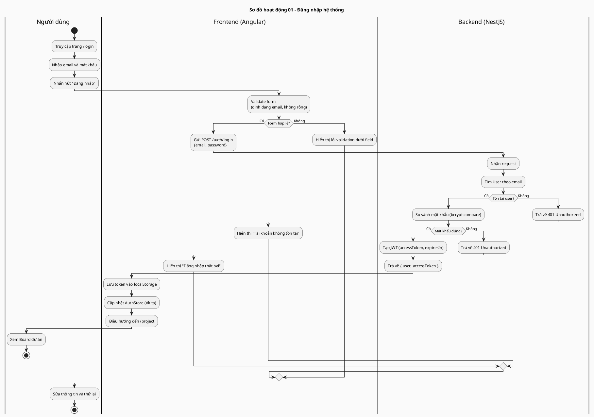
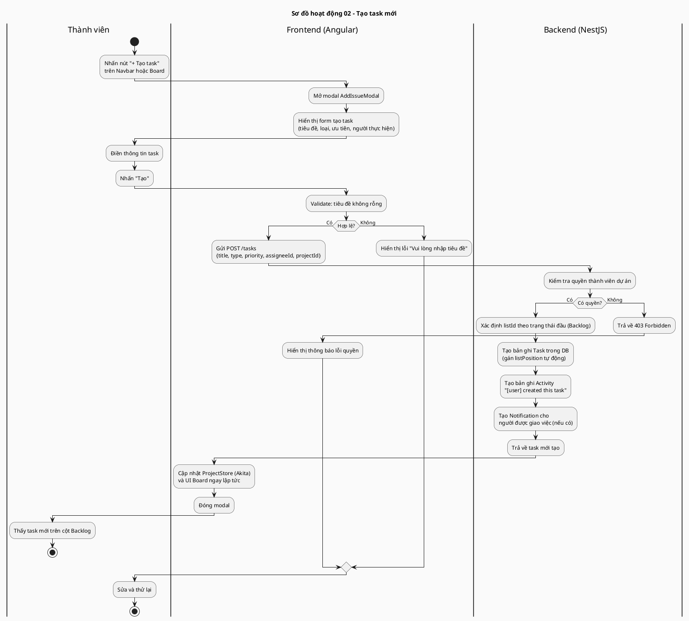
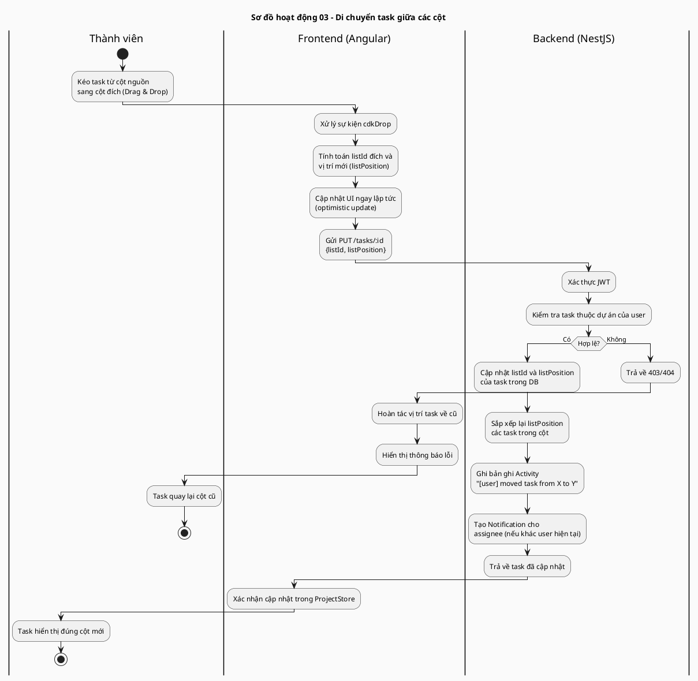
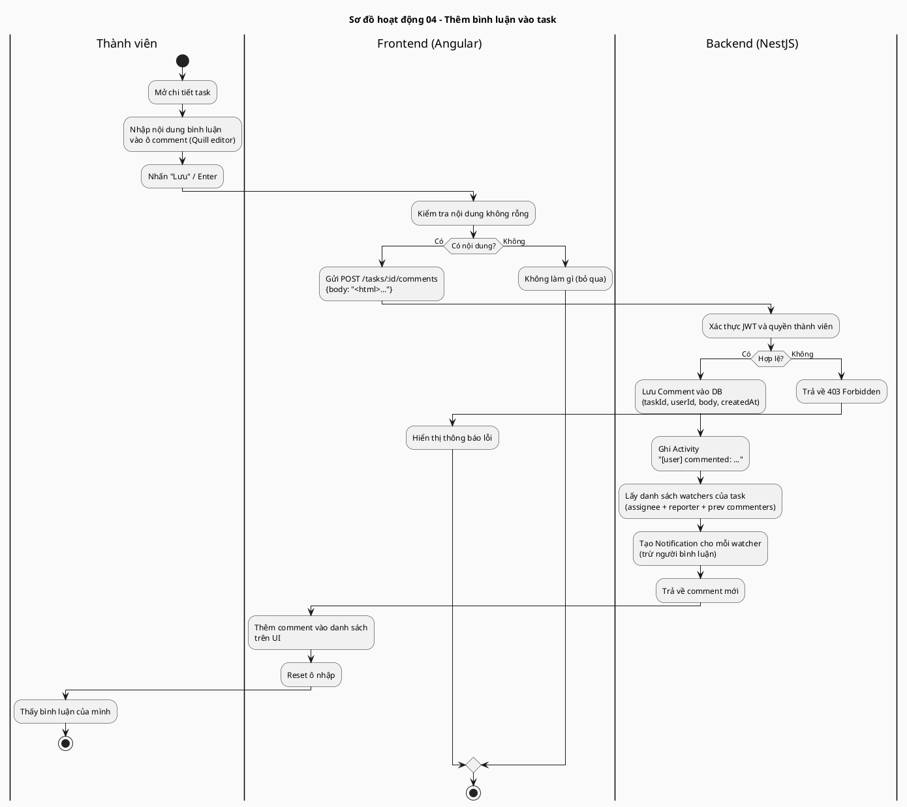
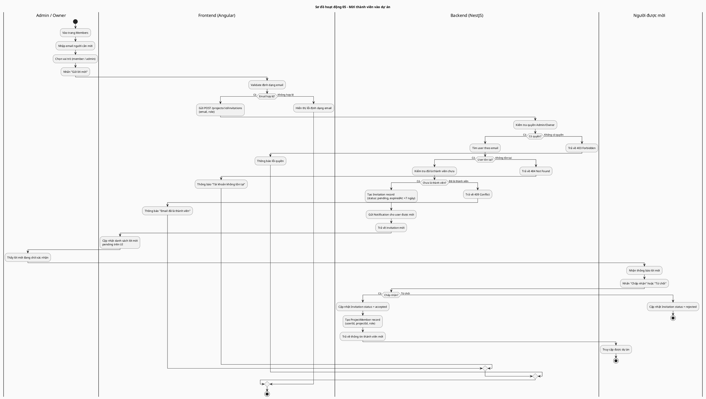
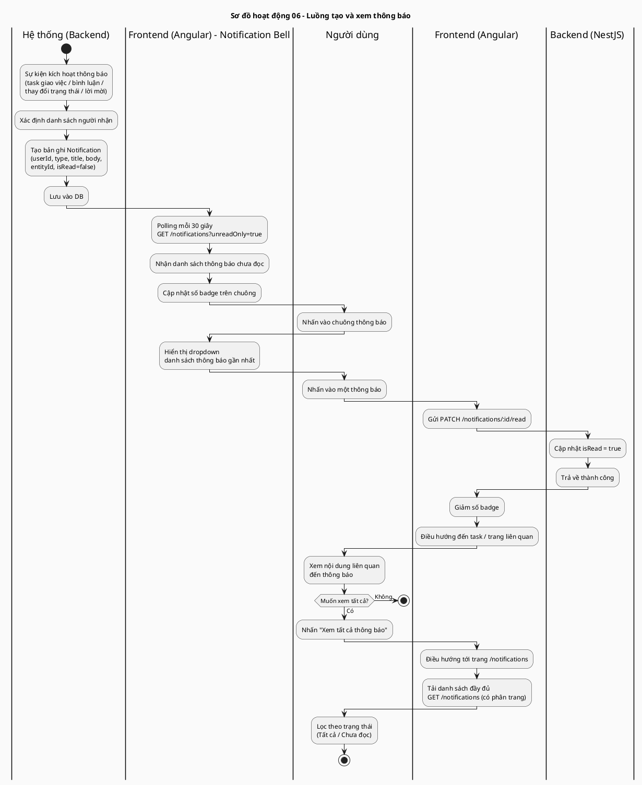
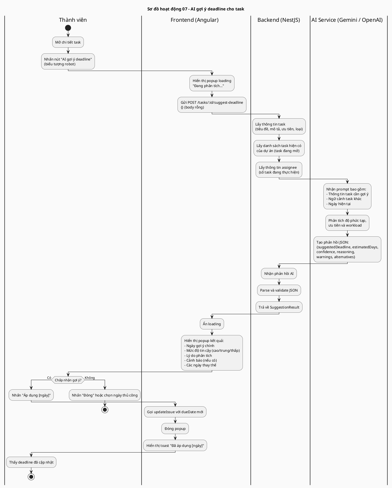
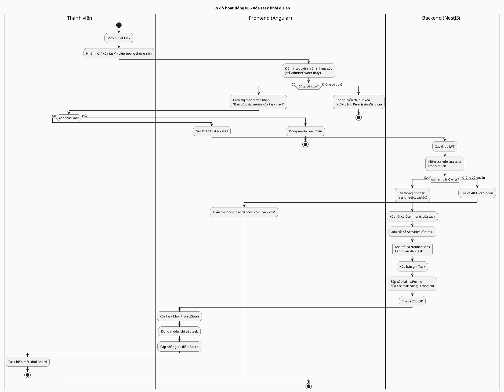

# Sơ đồ Activity Diagram – Hệ thống Quản lý Dự án

> Tất cả sơ đồ sử dụng cú pháp PlantUML (new-style activity diagram với swimlane).
> Render bằng: `java -jar plantuml.jar ACTIVITY_DIAGRAMS.md` hoặc paste vào https://www.plantuml.com/plantuml/

---

## Sơ đồ 1: Đăng nhập hệ thống



---

## Sơ đồ 2: Tạo task (Issue)



---

## Sơ đồ 3: Di chuyển task trên Board (thay đổi trạng thái)



---

## Sơ đồ 4: Bình luận trên task



---

## Sơ đồ 5: Mời thành viên vào dự án



---

## Sơ đồ 6: Luồng thông báo (Notification)



---

## Sơ đồ 7: AI gợi ý deadline



---

## Sơ đồ 8: Xóa task



---

## Cách render sơ đồ

### Render tất cả sang PNG

```powershell
# Tải PlantUML JAR: https://plantuml.com/download
java -jar plantuml.jar -charset UTF-8 ACTIVITY_DIAGRAMS.md
# Output: các file .png cùng thư mục
```

### Render online
Paste từng block `@startuml ... @enduml` vào: https://www.plantuml.com/plantuml/
