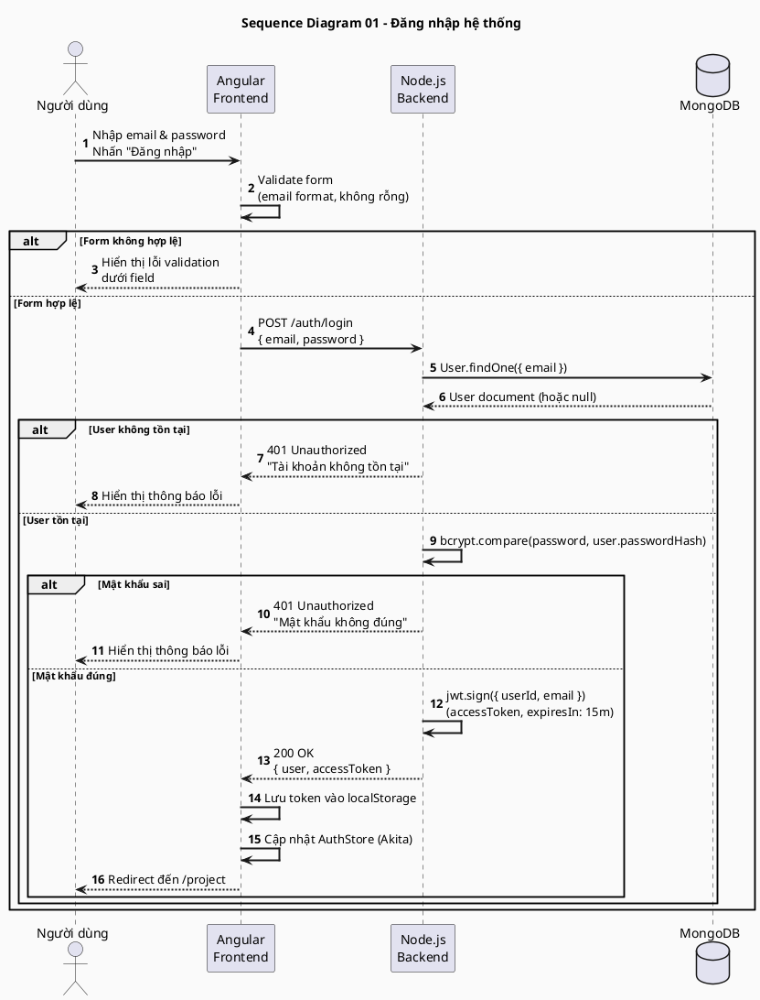
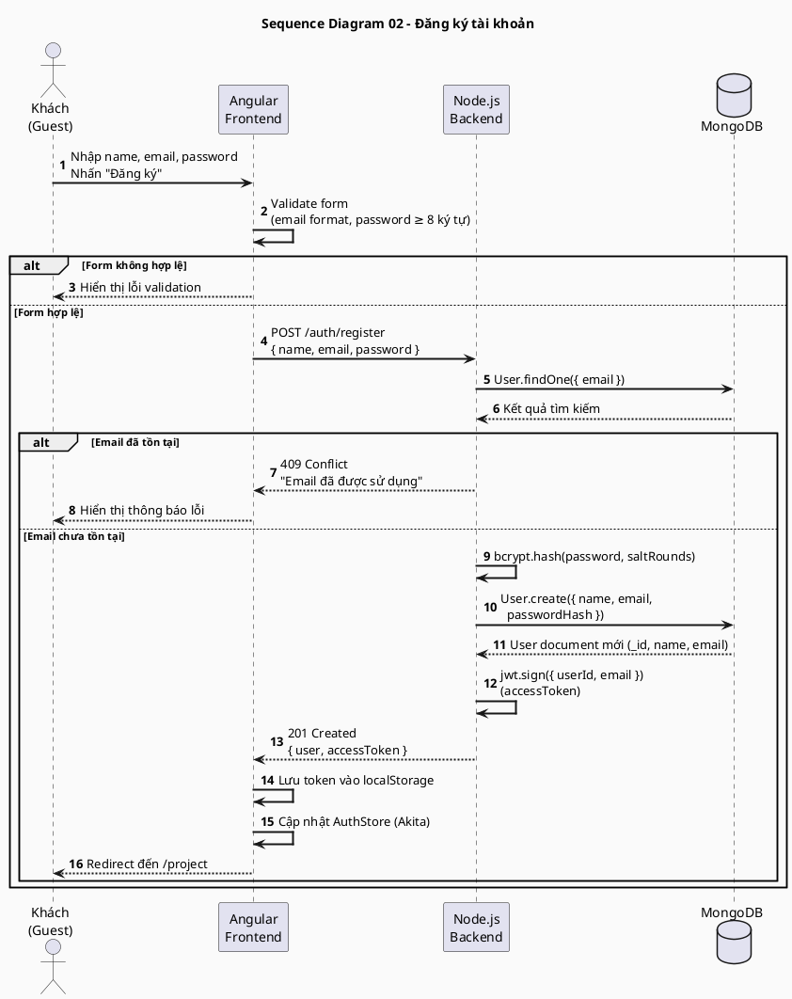
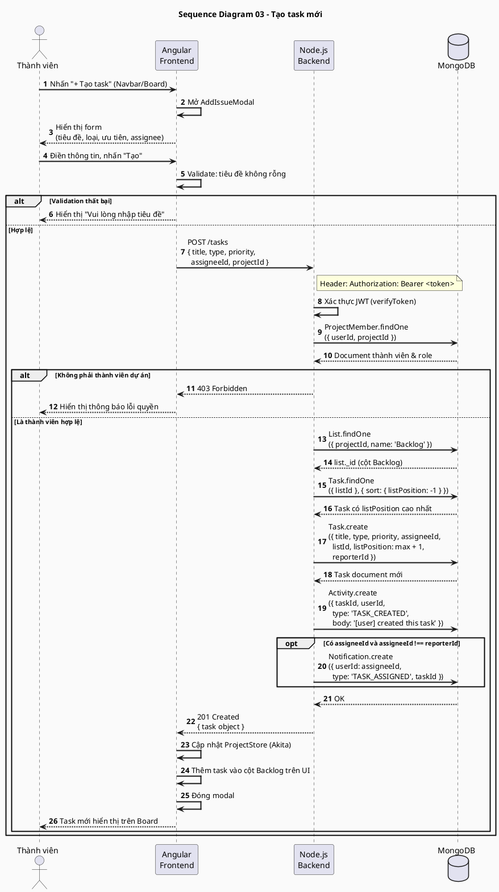
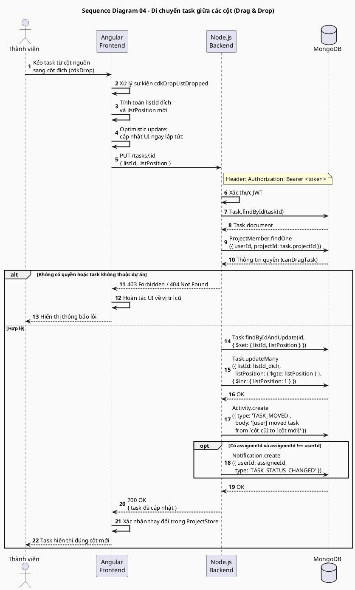
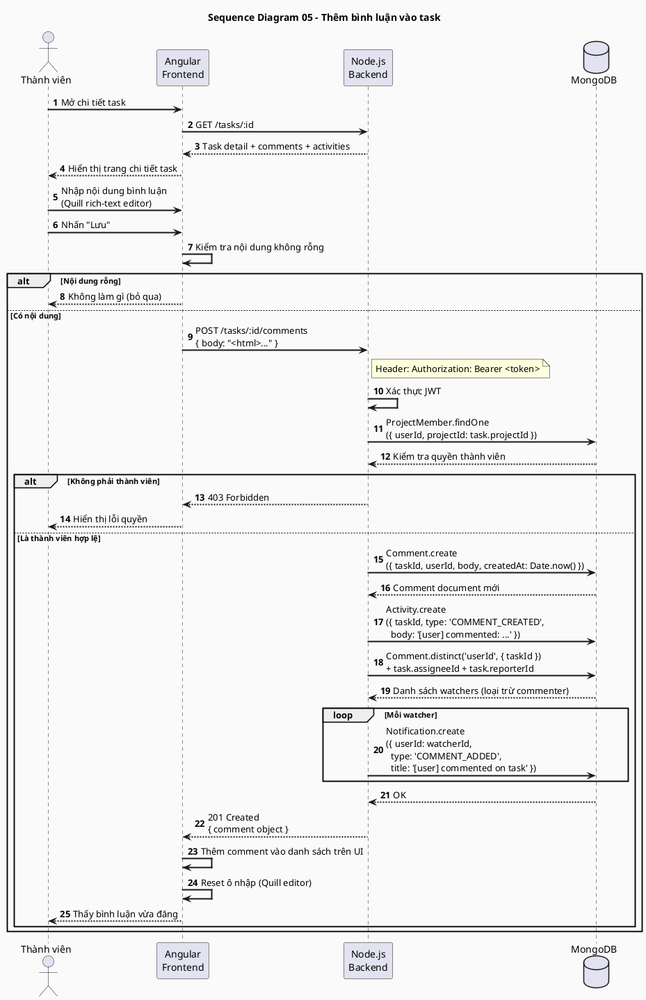
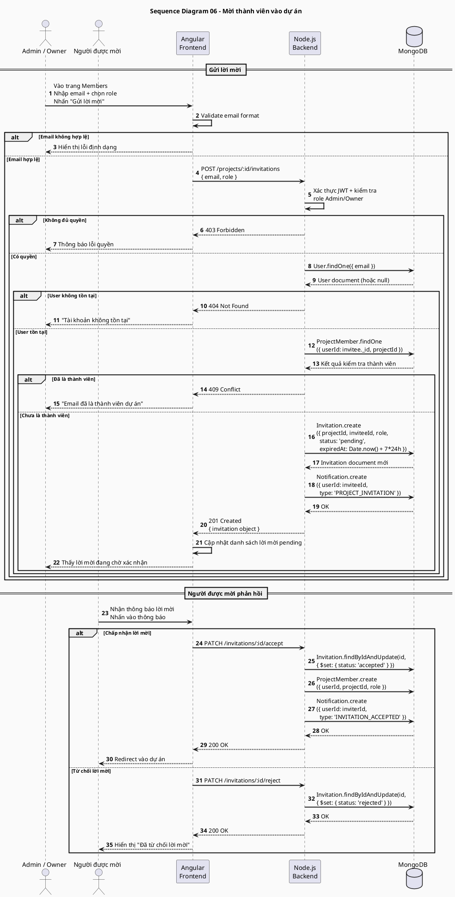
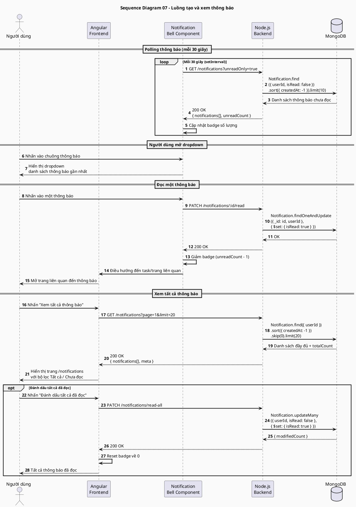
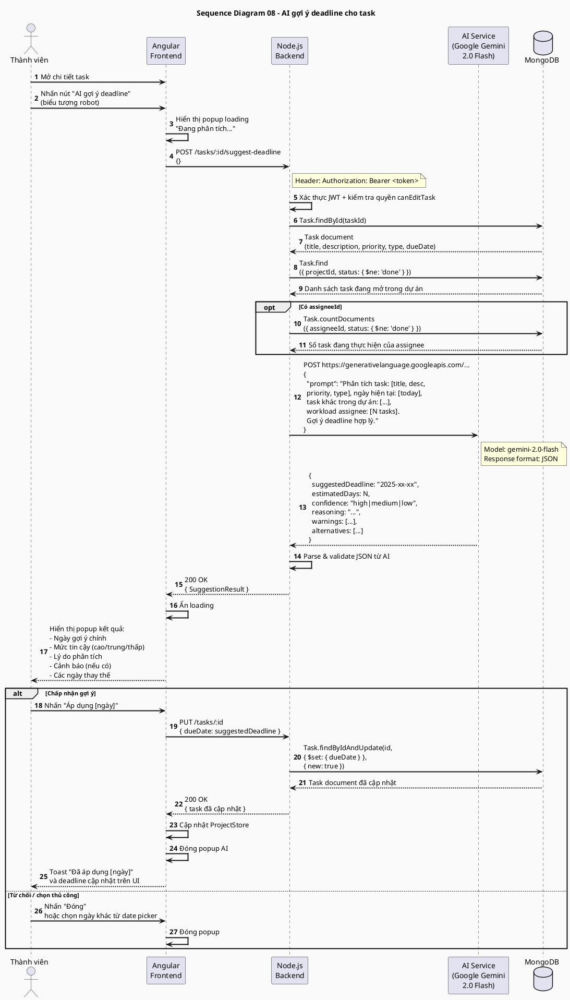
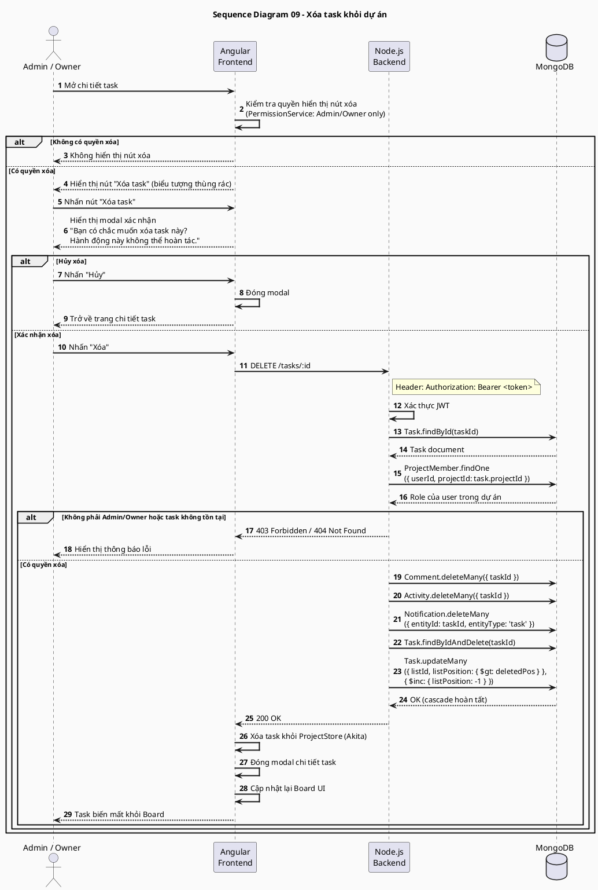
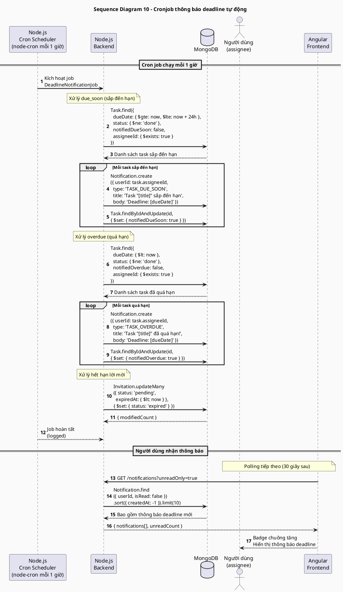

# Sơ đồ Sequence Diagram – Hệ thống Quản lý Dự án

> Tất cả sơ đồ sử dụng cú pháp PlantUML.
> Render bằng: `java -jar plantuml.jar SEQUENCE_DIAGRAMS.md` hoặc paste vào https://www.plantuml.com/plantuml/

---

## MỤC LỤC

| # | Sơ đồ | Luồng chính |
|---|-------|-------------|
| SD01 | [Đăng nhập hệ thống](#sd01-đăng-nhập-hệ-thống) | POST /auth/login → JWT |
| SD02 | [Đăng ký tài khoản](#sd02-đăng-ký-tài-khoản) | POST /auth/register |
| SD03 | [Tạo task mới](#sd03-tạo-task-mới) | POST /tasks → Board update |
| SD04 | [Di chuyển task (Drag & Drop)](#sd04-di-chuyển-task-drag--drop) | PUT /tasks/:id → reorder |
| SD05 | [Bình luận trên task](#sd05-bình-luận-trên-task) | POST /tasks/:id/comments |
| SD06 | [Mời thành viên vào dự án](#sd06-mời-thành-viên-vào-dự-án) | POST /invitations → accept |
| SD07 | [Luồng thông báo (Notification)](#sd07-luồng-thông-báo) | Polling + mark as read |
| SD08 | [AI gợi ý deadline](#sd08-ai-gợi-ý-deadline) | POST /suggest-deadline → Gemini |
| SD09 | [Xóa task](#sd09-xóa-task) | DELETE /tasks/:id → cascade |
| SD10 | [Cronjob thông báo deadline tự động](#sd10-cronjob-thông-báo-deadline-tự-động) | Cron → due_soon & overdue |

---

## SD01: Đăng nhập hệ thống



---

## SD02: Đăng ký tài khoản



---

## SD03: Tạo task mới



---

## SD04: Di chuyển task (Drag & Drop)



---

## SD05: Bình luận trên task



---

## SD06: Mời thành viên vào dự án



---

## SD07: Luồng thông báo



---

## SD08: AI gợi ý deadline



---

## SD09: Xóa task



---

## SD10: Cronjob thông báo deadline tự động



---

## Cách render sơ đồ

### Render tất cả sang PNG

```powershell
# Tải PlantUML JAR: https://plantuml.com/download
java -jar plantuml.jar -charset UTF-8 SEQUENCE_DIAGRAMS.md
# Output: các file .png cùng thư mục
```

### Render online
Paste từng block `@startuml ... @enduml` vào: https://www.plantuml.com/plantuml/
