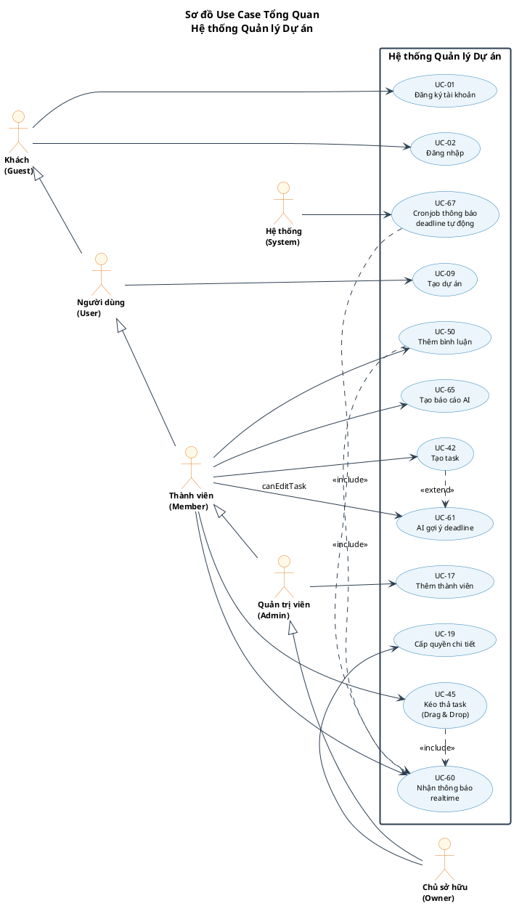
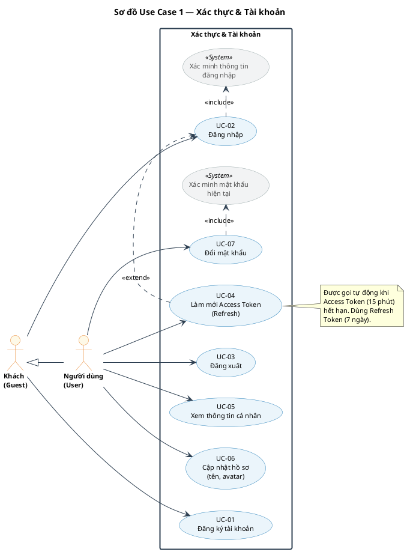
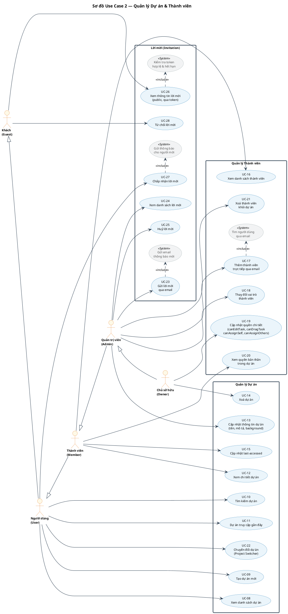
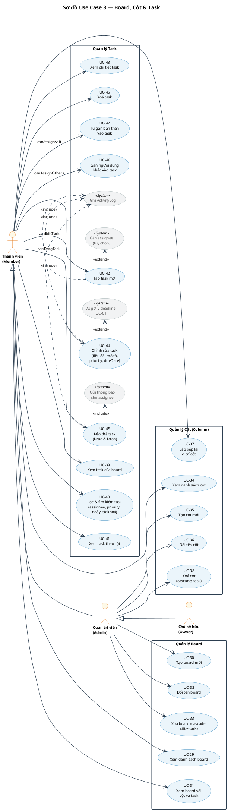
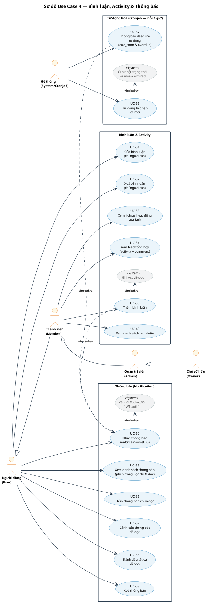
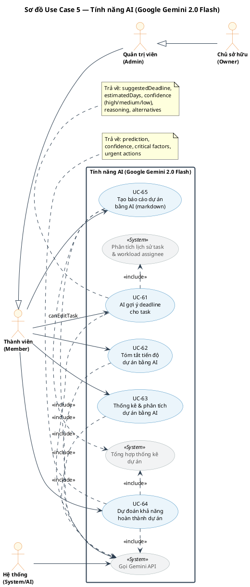

# SƠ ĐỒ USE CASE — HỆ THỐNG QUẢN LÝ DỰ ÁN

> **Render PlantUML:** Copy từng block vào [https://www.plantuml.com/plantuml/uml/](https://www.plantuml.com/plantuml/uml/)  
> Hoặc lưu từng block thành file `.puml` rồi chạy `generate.ps1` ở cuối file.

---

## MỤC LỤC

| # | Sơ đồ | Phạm vi | Số UC |
|---|-------|---------|-------|
| 0 | [Tổng quan hệ thống](#sơ-đồ-0-tổng-quan-hệ-thống) | 12 UC trụ cột | 12 |
| 1 | [Xác thực & Tài khoản](#sơ-đồ-1-xác-thực--tài-khoản) | UC-01 → UC-07 | 7 |
| 2 | [Quản lý Dự án & Thành viên](#sơ-đồ-2-quản-lý-dự-án--thành-viên) | UC-08 → UC-28 | 21 |
| 3 | [Board, Cột & Task](#sơ-đồ-3-board-cột--task) | UC-29 → UC-48 | 20 |
| 4 | [Bình luận, Activity & Thông báo](#sơ-đồ-4-bình-luận-activity--thông-báo) | UC-49 → UC-60, UC-66, UC-67 | 14 |
| 5 | [Tính năng AI](#sơ-đồ-5-tính-năng-ai) | UC-61 → UC-65 | 5 |
| | **Tổng** | | **67** |

---

## Sơ đồ 0: Tổng quan hệ thống

**Mục đích:** Bức tranh toàn cảnh hệ thống với 12 use case trụ cột — phù hợp trình bày trước hội đồng.

**Actors:** Guest · User · Member · Admin · Owner · System

**Quan hệ kế thừa actor:** `Guest <|-- User <|-- Member <|-- Admin <|-- Owner`

**Quan hệ include/extend nổi bật:**
- `UC-42` *(Tạo task)* `<<extend>>` `UC-61` *(AI gợi ý deadline)*
- `UC-45` *(Kéo thả task)* `<<include>>` `UC-60` *(Nhận thông báo realtime)*
- `UC-50` *(Thêm bình luận)* `<<include>>` `UC-60`
- `UC-67` *(Cronjob deadline)* `<<include>>` `UC-60`



---

## Sơ đồ 1: Xác thực & Tài khoản

**Phạm vi:** UC-01 → UC-07 | **Actors:** Guest, User



---

## Sơ đồ 2: Quản lý Dự án & Thành viên

**Phạm vi:** UC-08 → UC-28 | **Actors:** Guest, User, Member, Admin, Owner



---

## Sơ đồ 3: Board, Cột & Task

**Phạm vi:** UC-29 → UC-48 | **Actors:** Member, Admin, Owner



---

## Sơ đồ 4: Bình luận, Activity & Thông báo

**Phạm vi:** UC-49 → UC-60, UC-66, UC-67 | **Actors:** User, Member, Admin, Owner, System



---

## Sơ đồ 5: Tính năng AI

**Phạm vi:** UC-61 → UC-65 | **Actors:** Member, Admin, Owner, System



---

## Hướng dẫn tạo ảnh PNG (Windows)

> **Yêu cầu:** Java 8+ đã cài đặt (`java -version` để kiểm tra).

**Bước 1:** Lưu từng block PlantUML thành file `.puml` riêng (ví dụ: `uc00_overview.puml`, `uc01_auth.puml`, ...)

**Bước 2:** Tạo file `generate.ps1` cùng thư mục với nội dung sau, rồi chạy bằng PowerShell:

```powershell
# generate.ps1 — Chạy trong PowerShell tại thư mục chứa file .puml

$outputDir = ".\output"
$jarPath   = ".\plantuml.jar"
$jarUrl    = "https://github.com/plantuml/plantuml/releases/download/v1.2024.8/plantuml-1.2024.8.jar"

if (-not (Test-Path $outputDir)) {
    New-Item -ItemType Directory -Path $outputDir | Out-Null
    Write-Host "Tao thu muc output/" -ForegroundColor Green
}

if (-not (Test-Path $jarPath)) {
    Write-Host "Dang tai PlantUML jar..." -ForegroundColor Yellow
    Invoke-WebRequest -Uri $jarUrl -OutFile $jarPath
    Write-Host "Tai xong!" -ForegroundColor Green
}

$pumlFiles = Get-ChildItem -Path "." -Filter "*.puml"
if ($pumlFiles.Count -eq 0) {
    Write-Host "Khong tim thay file .puml trong thu muc nay." -ForegroundColor Red
    exit 1
}

foreach ($file in $pumlFiles) {
    Write-Host "Dang tao: $($file.Name) ..." -ForegroundColor Cyan
    java -jar $jarPath -charset UTF-8 -tpng -o (Resolve-Path $outputDir) $file.FullName
}

Write-Host "`nHoan thanh! File PNG nam trong: $outputDir" -ForegroundColor Green
```

**Hoặc dùng trực tuyến:** Copy từng block vào [https://www.plantuml.com/plantuml/uml/](https://www.plantuml.com/plantuml/uml/) → tải PNG về.
